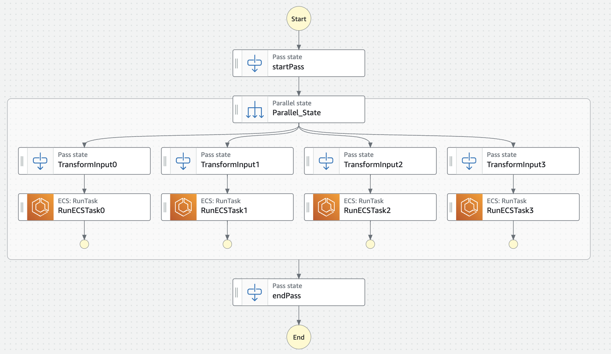
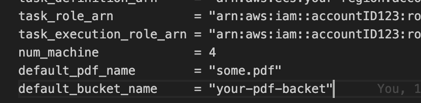
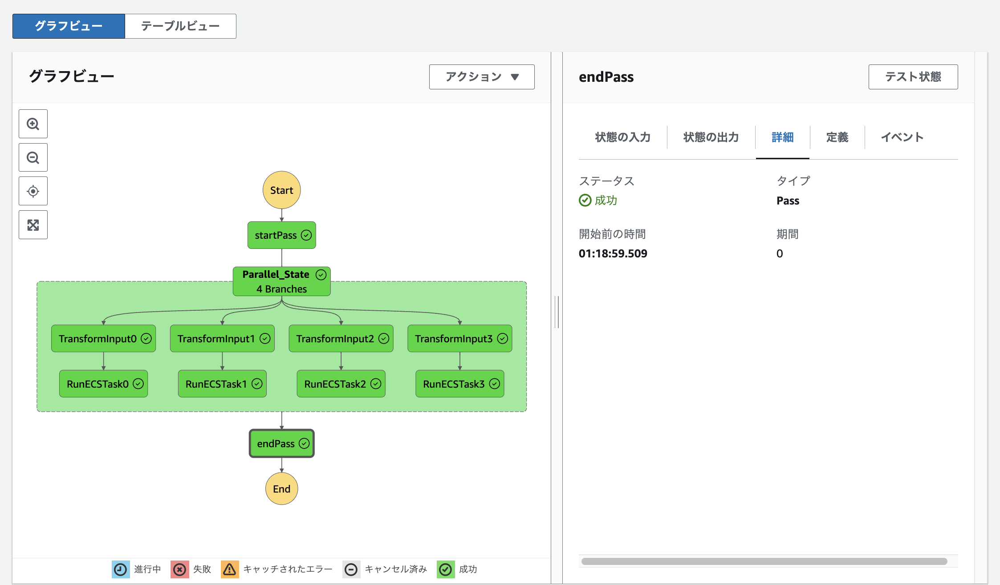
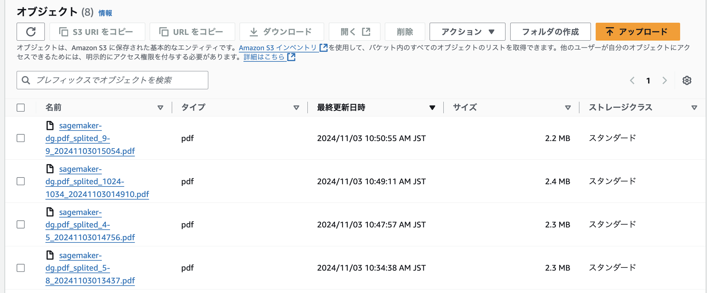

 <!--タイトル-->

 <!--
 _class: lead
 -->

# AWS微課金シリーズ
## StepFunctions X ECSで激重PDF分割をやってみよう
## やました(@atomisu0312)

---

# 自己紹介
<!--２段構えにしたい時はこのレイアウトを採用 -->
<div class="flex sa">
<div style="--fw: 2;">


</div>
<div style="--fw: 4;">

- IT企業で開発(名目上は開発支援)をやっているものです。
- 趣味：温泉巡り、ケトルベル、映画鑑賞
- 最近やっているところ：
AWS, Webフロント技術, データベース設計（IPA資格を取ろうかな？）
- 好きな言葉：
不撓不屈→え、休憩してないんすか
(休憩のコントロール＝最適化の指標)
</div>
</div>

---
# ポイント
- タスク処理をする場所としてクラウドが使える
  - お金はかかるけど手段として全然アリ
  - 使いこなせれば便利な相棒になりえる
- サーバレスなAWSのサービスについて知ってほしい
  - コンテナの活用により、迅速かつ簡単に環境を構築できます
  - 普通にサーバーを建てるよりも、使用額を安く抑えられます
- 実装の詳細については説明しません
- ネットワークやAWSの権限設定についても今回はスルーします
---

# 背景
<!--２段構えにしたい時はこのレイアウトを採用 -->
<div class="flex sa">
<div style="--fw: 2;">


</div>
<div style="--fw: 4;">

- PDFを読むツールとしてLuquidTextというサービスを使って読んでいました（LT発表用のサブプラン）
- PDFを読みながら文章でマインドマップを作ったりメモ書きができるので、思考整理しながら読むのに最適です。 
- 150MB程度のPDFを読みこませてみると、
- 時たま起こる沈黙、変えられないフォント、動かないワークスペース
- サイズの重いPDFを分割する必要が出てきました

</div>
</div>

---
# 背景（つづき）
<!--２段構えにしたい時はこのレイアウトを採用 -->
<div class="flex sa">
<div style="--fw: 2;">

</div>
<div style="--fw: 4;">

- ネットのツールでは分割できないので、自作ツールで分割をしよう
- 言語はGoでとりあえず開発（ほぼコピペ）
- 30分くらい終わらないコンソール、メモリを２GB近く消費する謎のプロセス
- ほしいページを間違えた時の絶望感
- 同時に複数実行したらどうなんだろう🧐

→ そうだ、Step Functions x ECRでやろう
</div>
</div>

---

# 処理の概要


---

# 重要なサービス

## 1. ECS (on Fargate)
## 2. Step Functions
## 3. IaCツール(Terraform)
---
# ECSとは

<!--２段構えにしたい時はこのレイアウトを採用 -->
<div class="flex sa">
<div style="--fw: 2;">


</div>
<div style="--fw: 4;">

- Elastic Container Serviceの略
- コンテナを実行するフルマネージドサービス
- コンテナの定義さえあれば、サーバーの存在を意識させずにアプリケーションを実行できるAWSのサービス
</div>
</div>

---

# コンテナとは

## 「アプリケーションの実行に必要な環境を独立した一つのパッケージとする仮想化技術」

---

# コンテナがない場合 
### アプリケーションの実行に必要な環境
- アプリケーションを実行するOSおよびマシン
- 必要なソフトウェアのインストール
- 煩雑な設定など
### これによって引き起こされる悲劇
- 同じコードなのに、人によって微妙に違う動きをする
- 1週間かかる環境構築

---

# コンテナがない場合 ~例え話~
#### 自作レシピのやきそばを作って売りたい
- 土地や物件の手配
- ガスや電気の配線整備
- 法的な手続き
- レシピ通りに作ってくれる人の手配
- その他諸々

焼きそば売りたいだけなのにやること多すぎ問題

---

# コンテナが"ある"場合 ~例え話~
#### 自作レシピのやきそばを作って売りたい
- 屋台を置いていい場所の準備
- どこでも焼きそばが作れる屋台セット(発電機やガスボンベつき)
- レシピ通りに作ってくれる人の手配

ここでいう屋台セットを、コンテナイメージと言います
→アプリケーションの実行に必要な環境を独立した一つのパッケージ

やるべきことは以下の３つに絞られる
→ ①屋台をおける場所, ②作ってくれる人、③屋台セットの準備

---

# コンテナイメージの定義ファイル
このように定義が記述されたファイルをDockerfileといいます
```docker
# すでにGoがインストールされている端末を持ってくる
FROM golang:1.23.2-alpine3.19 AS builder 
WORKDIR /app
COPY . .
# ここでコンパイル
RUN go mod download && go build -o main /app/main.go

#  コンパイルしたバイナリファイルをコピーして実行するだけ
FROM alpine:3.19
WORKDIR /app
COPY --from=builder /app/main .
CMD ["sh", "-c", "/app/main"]
```
---

# ECSのポイント
- とはいえ、結局Dockerホストや基盤となるOS、そして実際にそれを実行するリソースが必要なのは間違いない
- ECSを使うことで、Dockerホスト以下の環境はAWS側で用意してアプリを実行させる
  - コンテナイメージと諸々の設定さえ渡せば、AWS側でアプリケーションを実行できる
- さっきの屋台の例で言えば
  - 屋台セットの置いてある場所を教えれば、場所の確保と人の手配から実行までを運営側がやってくれます。

---

# ECSの使いどころ

- PDF分割タスクの実行に使っています。
- PDFをダウンロード→分割→アップロードするだけのタスクイメージを準備
- ECS上では、このイメージの場所と環境変数のみを指定して実行しています。
- ちなみにストレージにはS3というストレージをつかっています。

→ 課題点:いちいち指示するのは面倒でテンポが悪い


---
# Step Functions

<!--２段構えにしたい時はこのレイアウトを採用 -->
<div class="flex sa">
<div style="--fw: 2;">


</div>
<div style="--fw: 4;">

- 汎用的なワークフローを実行できるサービス。
- 複雑な処理のセットを定義し、実行することができます。
- フローがJSONっぽい言語で記述されており、AWSのサービスも呼べるうえ、HTTPリクエストも扱うことができる。

</div>
</div>

---
# Step Functionsの定義例
```javascript
{   StartAt : "Pass",
    States : {
      startPass : {
        "Comment" : "開始ステップ",
        "Type" : "Pass",
        "Next" : "Parallel_State",
      },
      WorkState : {
        "Comment" : "作業ステップ",
        "Type" : "Parallel",
        "Next" : "endPass",
        "Branches" : local.branches #　結構複雑なので、今回の例では省略
      },
      endPass : {
        "Comment" : "終了ステップ",
        "Type" : "Pass",
        End : true
      },
    }}
```
---

# State Functionsの使いどころ

<!--２段構えにしたい時はこのレイアウトを採用 -->

- 今回はStep FunctionsからECSタスクを実行するようなワークフローを作成しています
- StepFunctionsの入力を元に、ECSタスクに対して「どのPDF」の「どのページ」を抽出するのかを指示しています。
- 今は作っていないですが、成功したらメールを送るといった処理も可能です。

→ 課題点:フローを変えるのに、いちいち画面上で編集したりするのは面倒

---

# ステートマシンの構築例
<div class="flex sa">



</div>


---
# IaC（Infrastructure as Code）
- コードとしてインフラを定義する仕組み
- これまでの構築は画面（マネージメントコンソール）からの操作でも作れる。

- しかしながら、画面上で作成すると
  - 誰かに説明する時にスクリーンショットをとる必要がある
  - 複雑な操作だと時間がかかる
  - ミスが起こりやすくなる

---
# IaC（Infrastructure as Code）つづき
- コードで定義することによるメリット
  - 数回の操作でインフラを構築できる
  - ミスが起こりずらく、あっても特定しやすい
  - 再配布可能である
  - Gitなどで履歴を管理できる
  - etc...
- AWSのクラウド環境を構築する有名なIaCツールとして
  - Terraform, CDK, CloudFormation等が存在

---
# IaCの使いどころ

<!--２段構えにしたい時はこのレイアウトを採用 -->
<div class="flex sa">
  <div style="--fw: 2;">




  </div>
  <div style="--fw: 4;">

- 今回はTerraformというツールで構築

- 一応パラメータを変えるだけで並列で動くタスクの数が動的に変化できるようにしています。

- ここまでの環境を用意するのも一苦労なので、段階的にコード化している最中です
(現在作業中)

  </div>
</div>

---
# Step Functionsの実行結果
<div class="flex sa">



</div>

---
# S3のキャプチャ
<div class="flex sa">



</div>

---
 <!--サブタイトル-->

 <!--
 _class: lead
 -->

# 技術選定とかその他諸々
---

# AWSの課金形態
- 基本的には実行回数や実行期間で課金されます
  - 例外：reserved instancesなど
- 使わない時にはインスタンスを立ち上げないのが基本
- 常時立ち上げているサーバーではなく、使う時になったら都度用意することを「サーバレス」と言います
- AWS微課金勢としては、こちらを推したい
  - そもそも微課金とは、月5k以下の課金額を指す（と思っています）
---

# 一回あたりの合計コスト
- ECR
  - vCPU 0.050ドル / vCPU / hour
  - メモリ 0.0055ドル / GB / hour
  - 対象としたPDFだと分割に1時間かかりました 
  - 今回は1つのコンテナが4vCPUで8GBのメモリを1時間使用
- S3とStepFunctionsは割愛
  - S3: ほぼ無視
  - StepFunctions 0.025ドル / 1000回
- 1回の分割につき0.25ドル(=40円程度)かかる計算
---
# AWS Lambdaでよくないですか？
- AWSにおけるサーバレスサービスの代表的なものとしてAWS Lambdaがあります。
- コンテナ or 「コード」を指定するだけで、処理を実行できます。
  - 他のAWSのサービスの実行
  - HTTPリクエストやWebSocketの扱い
  - その他簡単な処理（サムネイル用の画像処理など）
- 最大実行時間が15分なので、数十分オーダーは平気でかかる今回みたいなみたいなタスクでは難しいと判断したので不採用

---
# そもそもChromeの印刷機能でPDF分割できますよね？
- 比較的早くできます。
- どういうアルゴリズムが採用されているのかは不明ですが、
6700p から2p抜き出しただけなのに、
150 MB →100MBだったのであまりやりたくない。。。

---
# Githubのコード
- https://github.com/atomisu0312/split_pdf_go
（作業中）